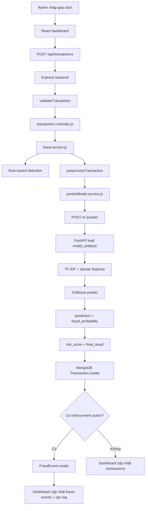

# projectNMAI - Fraud Detection AI Dashboard

Project này là hệ thống demo phát hiện giao dịch gian lận theo phong cách dashboard admin ngân hàng. Ứng dụng gồm frontend ReactJS, backend Node.js/Express, MongoDB và một AI inference microservice chạy FastAPI.

Backend kết hợp hai lớp đánh giá:

- Rule-based detection: kiểm tra nhanh theo số tiền và nội dung giao dịch.
- AI prediction: gọi microservice Python để chạy mô hình XGBoost đã huấn luyện.

Kết quả được lưu vào MongoDB và hiển thị trên dashboard với KPI, bảng giao dịch mới nhất, trạng thái service, enforcement log và log vận hành cập nhật liên tục. Khi giao dịch rủi ro cao, backend ghi log các hành động như chặn giao dịch, khóa thẻ hoặc khóa tài khoản.

## 1. Kiến Trúc

```text
Frontend dashboard
    |
    | HTTP
    v
Express backend
    |                    |
    | HTTP               | MongoDB driver
    v                    v
AI FastAPI service     MongoDB
    |
    v
model_artifacts/*.joblib
```

Các service chính:

```text
frontend        -> React dashboard, build bằng Vite, serve bằng nginx
backend         -> Express API, rule engine, enforcement logic
ai-service      -> FastAPI inference service, load model XGBoost
database        -> MongoDB, lưu transactions và fraud events
```

## 2. Cấu Trúc Project

```text
projectNMAI/
|
├── README.md
├── Prompt.md
├── docker-compose.yml
├── .dockerignore
├── .env.example
|
├── frontend/
|   ├── index.html
|   ├── package.json
|   ├── package-lock.json
|   ├── .env.example
|   ├── src/
|   |   ├── main.jsx
|   |   └── styles.css
|   ├── Dockerfile
|   ├── nginx.conf
|   └── .dockerignore
|
├── ai_service/
|   ├── Dockerfile
|   ├── requirements.txt
|   ├── .env.example
|   └── app/
|       └── main.py
|
└── fraud_backend/
    ├── server.js
    ├── package.json
    ├── package-lock.json
    ├── Dockerfile
    ├── .env.example
    ├── .dockerignore
    |
    ├── config/
    ├── controllers/
    ├── middlewares/
    ├── models/
    ├── routes/
    ├── services/
    ├── utils/
    ├── python/              # legacy local script
    └── model_artifacts/
        ├── xgb_fraud_model_combined.joblib
        ├── tfidf_vectorizer.joblib
        ├── robust_scaler.joblib
        ├── tabular_columns.joblib
        └── v_feature_means.joblib
```

## 3. Chạy Demo Bằng Docker Compose

```powershell
cd E:\projectNMAI
copy .env.example .env
docker compose up --build
```

Các cổng mặc định:

```text
Frontend dashboard: http://localhost:8080
Backend API:         http://localhost:5000
AI service:          http://localhost:8000
MongoDB database:    localhost:27017
```

Trong Docker Compose, backend gọi AI service qua hostname nội bộ:

```env
AI_SERVICE_URL=http://ai-service:8000
```

## 4. Biến Môi Trường

Backend:

```env
PORT=5000
MONGO_URI=mongodb://localhost:27017/fraud_detection
AI_SERVICE_URL=http://localhost:8000
AI_SERVICE_TIMEOUT_MS=8000
```

Frontend:

```env
VITE_API_BASE_URL=http://localhost:5000
```

AI service:

```env
MODEL_ARTIFACT_DIR=fraud_backend/model_artifacts
```

Các file `.env.example` được commit để làm mẫu. File `.env` thật bị ignore và không nên đưa lên GitHub.

## 5. Chạy Local Không Docker

### MongoDB

Chạy MongoDB local ở:

```text
mongodb://localhost:27017/fraud_detection
```

### AI Service

```powershell
cd E:\projectNMAI
python -m pip install -r ai_service\requirements.txt
set MODEL_ARTIFACT_DIR=fraud_backend\model_artifacts
uvicorn ai_service.app.main:app --host 0.0.0.0 --port 8000
```

### Backend

```powershell
cd E:\projectNMAI\fraud_backend
npm install
npm run dev
```

### Frontend

```powershell
cd E:\projectNMAI\frontend
npm install
npm run dev
```

Khi chạy bằng Docker, React sẽ được build thành static assets và nginx serve ở `http://localhost:8080`.

## 6. API Chính

### Health Check

```http
GET /api/health
```

Response gồm trạng thái backend, MongoDB và AI service.

### Tạo Giao Dịch Và Đánh Giá Gian Lận

```http
POST /api/transactions
```

Request body:

```json
{
  "account_id": "ACC-778801",
  "card_id": "CARD-9001",
  "customer_name": "Tran Bao Long",
  "amount": 9000000,
  "currency": "VND",
  "timestamp": "2026-05-25T02:30:00.000Z",
  "content": "tai khoan bi khoa chuyen tien gap",
  "merchant": "Unknown Gateway",
  "channel": "internet_banking",
  "location": "Unknown IP"
}
```

Response thành công:

```json
{
  "success": true,
  "data": {
    "rule_based_result": "fraud",
    "ai_result": "fraud",
    "final_result": "fraud",
    "ai_probability": 0.9987,
    "risk_score": 0.9987,
    "risk_level": "high",
    "ai_service_status": "online",
    "transaction_status": "blocked",
    "account_status": "locked",
    "card_status": "blocked",
    "enforcement_actions": [
      "transaction_blocked",
      "account_locked",
      "card_blocked"
    ],
    "decision_notes": [
      "Nội dung chứa tín hiệu rủi ro: khoa",
      "Mô hình AI đánh dấu giao dịch gian lận"
    ]
  }
}
```

### Lấy Danh Sách Giao Dịch

```http
GET /api/transactions?page=1&limit=12
```

API trả danh sách transaction mới nhất, có phân trang.

### Lấy Thống Kê Dashboard

```http
GET /api/transactions/stats
```

Các field chính:

```text
total
fraud_count
normal_count
high_risk_count
medium_risk_count
fraud_rate
total_amount
fraud_amount
average_risk_score
blocked_transactions
locked_accounts_count
blocked_cards_count
enforcement_count
last_checked_at
```

### Lấy Enforcement Log

```http
GET /api/fraud-events?page=1&limit=12
```

Event types:

```text
transaction_blocked
card_blocked
account_locked
manual_review
```

### AI Microservice

```http
GET  /health
POST /predict
```

Backend gửi payload đã chuẩn hóa sang `POST /predict`:

```json
{
  "amount": 9000000,
  "time": 1779651000,
  "timestamp": "2026-05-25T02:30:00.000Z",
  "Transaction_Content": "tai khoan bi khoa chuyen tien gap"
}
```

AI service trả:

```json
{
  "success": true,
  "data": {
    "prediction": "fraud",
    "confidence": 0.9987,
    "fraud_probability": 0.9987,
    "model": "xgb_fraud_model_combined"
  }
}
```

## 7. Luồng Xử Lý



## 8. Model Artifacts

Thư mục `fraud_backend/model_artifacts/` chứa các file `.joblib` dùng cho inference:

- `xgb_fraud_model_combined.joblib`: mô hình XGBoost.
- `tfidf_vectorizer.joblib`: vectorizer cho nội dung giao dịch.
- `robust_scaler.joblib`: scaler cho `Amount` và `Time`.
- `tabular_columns.joblib`: danh sách và thứ tự cột tabular khi train.
- `v_feature_means.joblib`: giá trị mean cho các cột `V1` đến `V28`.

AI service copy các artifact này vào image tại `/app/model_artifacts`.

## 9. Dashboard

Dashboard React trong `frontend/src/main.jsx` gồm:

- KPI tổng giao dịch, giao dịch bị chặn, tài khoản/thẻ bị khóa, điểm rủi ro trung bình.
- Form kiểm tra giao dịch mới với tài khoản, thẻ, khách hàng, kênh, merchant và vị trí.
- Trạng thái backend, MongoDB, AI service.
- Bảng giao dịch mới nhất.
- Enforcement log cho tài khoản/thẻ/giao dịch bị xử lý.
- Ops stream cập nhật liên tục bằng polling.

Frontend mặc định gọi backend ở:

```js
const API_BASE = import.meta.env.VITE_API_BASE_URL || 'http://localhost:5000';
```

## 10. Ghi Log Và Fallback

Backend dùng Winston:

```text
logs/error.log
logs/combined.log
console
```

Nếu AI service lỗi hoặc timeout:

- Backend không crash.
- `fraud.service.js` dùng rule-based fallback.
- Transaction lưu `ai_service_status = fallback`.
- Dashboard vẫn hiển thị kết quả và log vận hành.

## 11. Lưu Ý Khi Train Lại Model

Nếu train lại model, cần cập nhật đồng bộ toàn bộ artifact:

```python
joblib.dump(xgb_model_combined, "xgb_fraud_model_combined.joblib")
joblib.dump(tfidf, "tfidf_vectorizer.joblib")
joblib.dump(scaler, "robust_scaler.joblib")
joblib.dump(tabular_columns, "tabular_columns.joblib")
joblib.dump(v_feature_means, "v_feature_means.joblib")
```

Thứ tự feature khi inference phải giữ đúng:

```text
X = [TF-IDF text features, tabular features]
```
