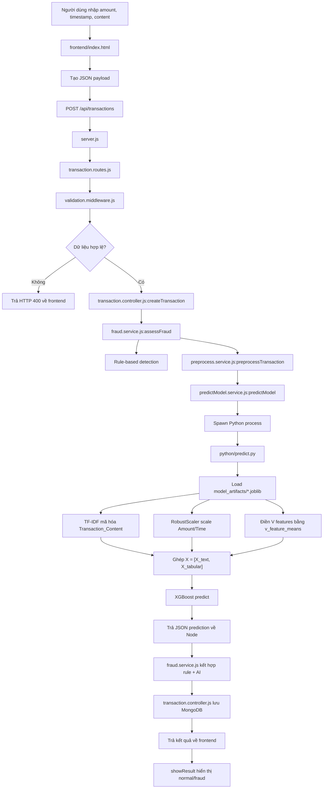
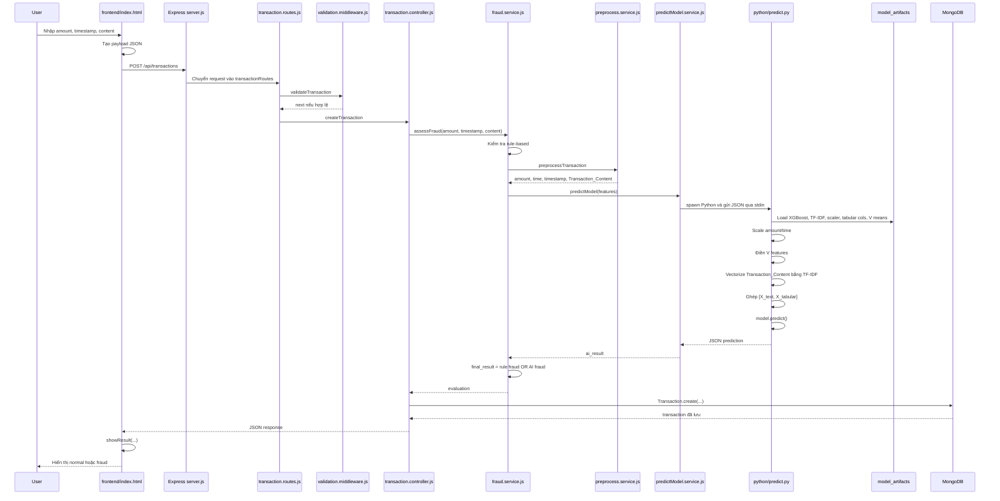

# projectNMAI - Fraud Detection AI

Project này là hệ thống phát hiện giao dịch gian lận gồm frontend HTML thuần và backend Node.js/Express. Backend kết hợp hai lớp đánh giá:

- Rule-based detection: kiểm tra nhanh bằng luật đơn giản.
- AI prediction: gọi script Python để chạy mô hình XGBoost đã huấn luyện, kết hợp dữ liệu bảng và nội dung giao dịch.

Kết quả cuối cùng được lưu vào MongoDB và trả về frontend để hiển thị cho người dùng.

## 1. Cấu Trúc Project

```text
projectNMAI/
|
├── README.md
├── Prompt.md
├── package-lock.json
|
├── frontend/
|   └── index.html
|
└── fraud_backend/
    ├── server.js
    ├── package.json
    ├── package-lock.json
    ├── requirements.txt
    ├── Dockerfile
    ├── .env
    |
    ├── config/
    |   └── db.js
    |
    ├── controllers/
    |   └── transaction.controller.js
    |
    ├── middlewares/
    |   ├── validation.middleware.js
    |   └── error.middleware.js
    |
    ├── models/
    |   └── transaction.model.js
    |
    ├── routes/
    |   └── transaction.routes.js
    |
    ├── services/
    |   ├── fraud.service.js
    |   ├── preprocess.service.js
    |   └── predictModel.service.js
    |
    ├── python/
    |   └── predict.py
    |
    ├── model_artifacts/
    |   ├── xgb_fraud_model_combined.joblib
    |   ├── tfidf_vectorizer.joblib
    |   ├── robust_scaler.joblib
    |   ├── tabular_columns.joblib
    |   └── v_feature_means.joblib
    |
    ├── utils/
    |   └── logger.js
    |
    └── logs/
        ├── combined.log
        └── error.log
```

## 2. Vai Trò Từng Phần

### Frontend

File: `frontend/index.html`

Đây là giao diện người dùng. File này đảm nhận:

- Hiển thị form nhập giao dịch.
- Nhận số tiền, thời gian, nội dung chuyển khoản.
- Gửi request đến backend qua API `POST http://localhost:5000/api/transactions`.
- Nhận kết quả từ backend.
- Hiển thị trạng thái giao dịch là an toàn hoặc gian lận.

Các input chính:

```text
amount      -> số tiền giao dịch
timestamp   -> thời gian giao dịch
content     -> nội dung chuyển khoản
```

### Backend Express

Thư mục: `fraud_backend/`

Backend đảm nhận:

- Nhận request từ frontend.
- Validate dữ liệu đầu vào.
- Chạy rule-based detection.
- Gọi Python để chạy mô hình AI.
- Kết hợp kết quả rule-based và AI.
- Lưu giao dịch vào MongoDB.
- Trả kết quả về frontend.

### Python AI

File: `fraud_backend/python/predict.py`

Script Python đảm nhận toàn bộ phần inference của mô hình AI:

- Load model XGBoost.
- Load TF-IDF vectorizer.
- Load RobustScaler.
- Load danh sách cột tabular đã dùng khi train.
- Load giá trị mean của các cột `V`.
- Tiền xử lý dữ liệu đầu vào.
- Ghép vector text và vector tabular theo đúng thứ tự lúc huấn luyện.
- Gọi `model.predict()` và `model.predict_proba()`.
- Trả kết quả JSON về Node.js.

## 3. Các Artifact Của Mô Hình

Các file nằm trong `fraud_backend/model_artifacts/`.

### `xgb_fraud_model_combined.joblib`

Đây là mô hình XGBoost đã huấn luyện xong. Model nhận input đã được ghép từ:

```text
[TF-IDF text features] + [tabular features]
```

Sau đó dự đoán:

```text
0 -> normal
1 -> fraud
```

### `tfidf_vectorizer.joblib`

Dùng để mã hóa nội dung chuyển khoản `Transaction_Content`.

Ví dụ text:

```text
"tai khoan bi khoa chuyen tien gap"
```

sẽ được biến thành vector số bằng TF-IDF. Vectorizer này phải đúng với vectorizer đã fit trong quá trình train.

### `robust_scaler.joblib`

Dùng để chuẩn hóa các giá trị số như:

```text
Amount
Time
```

Sau khi scale, Python tạo ra:

```text
scaled_amount
scaled_time
```

### `tabular_columns.joblib`

Lưu danh sách các cột tabular mà model đã dùng khi train, đúng thứ tự.

Ví dụ:

```text
[
  "scaled_amount",
  "scaled_time",
  "V1",
  "V2",
  ...
]
```

File này rất quan trọng vì lúc predict, backend phải tạo tabular vector đúng thứ tự như khi train. Nếu sai thứ tự cột, model vẫn chạy nhưng kết quả có thể sai.

### `v_feature_means.joblib`

Lưu giá trị trung bình của các cột `V` còn được dùng trong model.

Trong app thật, người dùng chỉ nhập:

```text
amount, timestamp, content
```

Nhưng model được train với các cột PCA/ẩn danh như:

```text
V1, V2, V3, ...
```

Vì người dùng không nhập các cột `V`, script Python dùng mean từ training dataset để điền giá trị thay thế hợp lý.

## 4. Biến Môi Trường

File: `fraud_backend/.env`

Các biến chính:

```env
PORT=5000
MONGO_URI=mongodb://localhost:27017/fraud_detection
PYTHON_BIN=C:\Users\ACER\AppData\Local\Programs\Python\Python313\python.exe
```

Ý nghĩa:

- `PORT`: port chạy backend Express.
- `MONGO_URI`: chuỗi kết nối MongoDB.
- `PYTHON_BIN`: đường dẫn Python có cài các thư viện AI như `joblib`, `scikit-learn`, `xgboost`.

Nếu không có `PYTHON_BIN`, backend sẽ gọi mặc định là `python`. Điều này có thể lỗi nếu máy có nhiều Python khác nhau.

## 5. Cài Đặt Và Chạy Project

### Cài dependency Node.js

```powershell
cd E:\projectNMAI\fraud_backend
npm install
```

### Cài dependency Python

```powershell
cd E:\projectNMAI\fraud_backend
python -m pip install -r requirements.txt
```

File `requirements.txt` gồm:

```text
joblib
numpy
scipy
scikit-learn
xgboost
```

### Chạy backend

```powershell
cd E:\projectNMAI\fraud_backend
npm run dev
```

hoặc:

```powershell
npm start
```

Backend mặc định chạy tại:

```text
http://localhost:5000
```

### Mở frontend

Mở file:

```text
frontend/index.html
```

Frontend sẽ gọi API:

```text
POST http://localhost:5000/api/transactions
```

## 6. API Chính

### Tạo giao dịch và đánh giá gian lận

```http
POST /api/transactions
```

Request body:

```json
{
  "amount": 9000000,
  "timestamp": "2026-05-25T02:30:00.000Z",
  "content": "tai khoan bi khoa chuyen tien gap"
}
```

Response thành công:

```json
{
  "success": true,
  "data": {
    "transaction": {
      "amount": 9000000,
      "timestamp": "2026-05-25T02:30:00.000Z",
      "content": "tai khoan bi khoa chuyen tien gap",
      "rule_based_result": "normal",
      "ai_result": "fraud",
      "final_result": "fraud"
    },
    "rule_based_result": "normal",
    "ai_result": "fraud",
    "final_result": "fraud"
  }
}
```

### Lấy danh sách giao dịch

```http
GET /api/transactions?page=1&limit=10
```

API này trả danh sách transaction mới nhất, có phân trang.

### Lấy thống kê

```http
GET /api/transactions/stats
```

API này trả:

```text
total        -> tổng số giao dịch
fraud_count  -> số giao dịch gian lận
normal_count -> số giao dịch bình thường
```

## 7. Biểu Đồ Luồng Tổng Thể



## 8. Luồng Code Chi Tiết Từ Frontend Đến MongoDB

### Bước 1: Người dùng nhập giao dịch

Người dùng thao tác tại `frontend/index.html`.

Các trường trên form:

```html
<input type="number" id="txAmount">
<input type="datetime-local" id="txTime">
<textarea id="txContent"></textarea>
```

Khi bấm nút phân tích, frontend bắt sự kiện:

```js
form.addEventListener('submit', async (e) => {
    e.preventDefault();
    ...
});
```

Frontend tạo payload:

```js
const payload = {
    amount: parseFloat(document.getElementById('txAmount').value),
    timestamp: new Date(document.getElementById('txTime').value).toISOString(),
    content: document.getElementById('txContent').value
};
```

Ý nghĩa:

- `amount` được ép thành số thực.
- `timestamp` được chuyển thành ISO string.
- `content` giữ nguyên nội dung chuyển khoản người dùng nhập.

Sau đó gửi request:

```js
fetch('http://localhost:5000/api/transactions', {
    method: 'POST',
    headers: { 'Content-Type': 'application/json' },
    body: JSON.stringify(payload)
});
```

### Bước 2: Express nhận request

File: `fraud_backend/server.js`

Khi backend chạy, `server.js` thực hiện:

```js
dotenv.config();
connectDB();
app.use(cors());
app.use(express.json());
app.use('/api/', apiLimiter);
app.use('/api/transactions', transactionRoutes);
app.use(errorHandler);
```

Ý nghĩa:

- `dotenv.config()` đọc `.env`.
- `connectDB()` kết nối MongoDB.
- `cors()` cho phép frontend gọi API.
- `express.json()` giúp Express đọc JSON body.
- `apiLimiter` giới hạn 100 request mỗi 15 phút cho `/api/*`.
- `/api/transactions` được chuyển sang route trong `transaction.routes.js`.
- `errorHandler` xử lý lỗi tập trung.

### Bước 3: Route điều hướng request

File: `fraud_backend/routes/transaction.routes.js`

Route chính:

```js
router.post('/', validateTransaction, createTransaction);
```

Với request:

```text
POST /api/transactions
```

Express sẽ chạy theo thứ tự:

```text
validateTransaction -> createTransaction
```

### Bước 4: Validate dữ liệu đầu vào

File: `fraud_backend/middlewares/validation.middleware.js`

Middleware dùng Joi để kiểm tra:

```js
amount: Joi.number().positive().required()
timestamp: Joi.date().iso().required()
content: Joi.string().allow('', null).optional()
```

Nếu dữ liệu sai, backend trả:

```json
{
  "success": false,
  "message": "Amount must be greater than 0"
}
```

Nếu dữ liệu đúng, middleware gọi:

```js
next();
```

và request đi tiếp vào controller.

### Bước 5: Controller nhận dữ liệu và gọi service

File: `fraud_backend/controllers/transaction.controller.js`

Hàm xử lý:

```js
createTransaction(req, res, next)
```

Controller lấy dữ liệu:

```js
const { amount, timestamp, content } = req.body;
```

Sau đó gọi:

```js
const evaluation = await assessFraud(amount, timestamp, content);
```

Hàm `assessFraud` nằm trong:

```text
fraud_backend/services/fraud.service.js
```

### Bước 6: Fraud service chạy rule-based detection

File: `fraud_backend/services/fraud.service.js`

Hàm chính:

```js
assessFraud(amount, timestamp, content)
```

Đầu tiên service tạo kết quả mặc định:

```js
let rule_based_result = "normal";
```

Sau đó kiểm tra số tiền:

```js
if (amount > 500_000_000) {
    rule_based_result = "fraud";
}
```

Nếu số tiền lớn hơn 500 triệu, rule-based đánh dấu là gian lận.

Tiếp theo kiểm tra nội dung:

```js
if (lowerContent.includes('hack') ||
    lowerContent.includes('scam') ||
    lowerContent.includes('fake')) {
    rule_based_result = "fraud";
}
```

Nếu nội dung chứa `hack`, `scam`, hoặc `fake`, rule-based cũng đánh dấu là gian lận.

### Bước 7: Node tiền xử lý dữ liệu thô trước khi gửi Python

File: `fraud_backend/services/preprocess.service.js`

Hàm:

```js
preprocessTransaction(amount, timestamp, content)
```

Hàm này chưa chạy model. Nó chỉ chuẩn hóa payload để gửi sang Python:

```js
return {
    amount,
    time: Math.floor(safeDate.getTime() / 1000),
    timestamp,
    Transaction_Content: content || ""
};
```

Ý nghĩa:

- `amount`: giữ nguyên số tiền.
- `time`: chuyển timestamp thành Unix timestamp tính bằng giây.
- `timestamp`: giữ lại ISO timestamp gốc.
- `Transaction_Content`: đổi tên `content` thành đúng tên feature text mà pipeline model dùng.

Các cột `V` không được tạo ở Node. Python sẽ điền bằng `v_feature_means.joblib`.

### Bước 8: Node gọi Python prediction script

File: `fraud_backend/services/predictModel.service.js`

Hàm:

```js
predictModel(features)
```

Service này gọi Python bằng:

```js
const pythonBin = process.env.PYTHON_BIN || 'python';
const pythonProcess = spawn(pythonBin, [scriptPath]);
```

Trong đó:

```js
scriptPath = fraud_backend/python/predict.py
```

Node gửi dữ liệu sang Python qua `stdin`:

```js
pythonProcess.stdin.write(inputData);
pythonProcess.stdin.end();
```

Python trả kết quả về Node qua `stdout`.

Nếu Python lỗi, service ghi log và fallback:

```js
resolve({ prediction: "normal" });
```

Điều này giúp backend không crash khi model gặp lỗi, nhưng cũng có nghĩa là lỗi model có thể làm AI tạm trả normal.

### Bước 9: Python load artifacts

File: `fraud_backend/python/predict.py`

Khi chạy, script định nghĩa các đường dẫn:

```python
MODEL_PATH = ARTIFACT_DIR / "xgb_fraud_model_combined.joblib"
VECTORIZER_PATH = ARTIFACT_DIR / "tfidf_vectorizer.joblib"
SCALER_PATH = ARTIFACT_DIR / "robust_scaler.joblib"
TABULAR_COLUMNS_PATH = ARTIFACT_DIR / "tabular_columns.joblib"
V_FEATURE_MEANS_PATH = ARTIFACT_DIR / "v_feature_means.joblib"
```

Hàm:

```python
load_artifacts()
```

load các artifact bằng `joblib.load()`:

```python
MODEL = joblib.load(MODEL_PATH)
VECTORIZER = joblib.load(VECTORIZER_PATH)
SCALER = joblib.load(SCALER_PATH)
TABULAR_COLUMNS = list(joblib.load(TABULAR_COLUMNS_PATH))
V_FEATURE_MEANS = joblib.load(V_FEATURE_MEANS_PATH)
```

Các biến này được cache trong process Python.

### Bước 10: Python xử lý thời gian và số tiền

Trong `predict.py`, hàm:

```python
get_amount_and_time(input_data)
```

lấy:

```python
amount = float(input_data.get("amount") or input_data.get("Amount") or 0)
time_value = float(input_data.get("time") or input_data.get("Time") or timestamp.timestamp())
```

Nếu timestamp là chuỗi ISO, hàm:

```python
parse_timestamp(value)
```

sẽ parse thành `datetime`.

Nếu timestamp là Unix milliseconds, script tự chia về seconds:

```python
if value > 1e10:
    value = value / 1000.0
```

### Bước 11: Python scale Amount và Time

Hàm:

```python
scale_amount_and_time(input_data, scaler)
```

dùng `robust_scaler.joblib` để scale `amount` và `time`.

Kết quả tạo:

```python
{
    "scaled_amount": ...,
    "scaled_time": ...
}
```

Nếu scaler có `feature_names_in_`, script dùng tên cột để map chính xác. Nếu không có, script dựa vào `n_features_in_`.

### Bước 12: Python tạo tabular features

Hàm:

```python
build_tabular_features(input_data, scaler, tabular_columns, v_feature_means)
```

Hàm này tạo một row dữ liệu bảng:

```python
row = {
    "scaled_amount": scaled_features["scaled_amount"],
    "scaled_time": scaled_features["scaled_time"],
}
```

Với các cột `V`, script xử lý:

```python
if column.startswith("V"):
    row[column] = float(input_data.get(column, v_feature_means.get(column, 0)))
```

Ý nghĩa:

- Nếu input có sẵn `V1`, `V2`, ... thì dùng giá trị input.
- Nếu input không có, dùng mean từ `v_feature_means.joblib`.
- Nếu mean cũng không có, fallback về `0`.

Sau đó script tạo vector đúng thứ tự:

```python
values = [row.get(column, float(input_data.get(column, 0))) for column in tabular_columns]
```

`tabular_columns` đảm bảo thứ tự cột giống lúc huấn luyện.

### Bước 13: Python mã hóa nội dung chuyển khoản bằng TF-IDF

Hàm:

```python
get_content(input_data)
```

lấy text từ:

```python
Transaction_Content
content
processed_content
```

Sau đó trong `predict()`:

```python
text_features = vectorizer.transform([str(get_content(input_data)).lower()])
```

Đây là bước mã hóa chữ thành vector số. Ví dụ:

```text
"tai khoan bi khoa chuyen tien gap"
```

được biến thành sparse vector TF-IDF.

### Bước 14: Python ghép feature đúng thứ tự train

Trong notebook huấn luyện, model combined được train theo dạng:

```python
X = hstack([X_text, X_tabular])
```

Vì vậy trong backend, `predict.py` cũng ghép đúng thứ tự:

```python
combined_features = hstack([text_features, csr_matrix(tabular_features)])
```

Thứ tự này rất quan trọng:

```text
TF-IDF features đứng trước
Tabular features đứng sau
```

Nếu đảo ngược thứ tự, model có thể vẫn chạy nhưng dự đoán sai.

### Bước 15: Python gọi XGBoost để dự đoán

Trong `predict.py`, hàm:

```python
predict(input_data)
```

gọi:

```python
predicted_class = model.predict(combined_features)[0]
```

Sau đó đổi class sang label:

```python
prediction = class_to_label(predicted_class)
```

Mapping:

```text
0 -> normal
1 -> fraud
```

Nếu model hỗ trợ probability, script gọi thêm:

```python
probabilities = model.predict_proba(combined_features)[0]
```

Kết quả Python trả về Node dạng JSON:

```json
{
  "prediction": "fraud",
  "probability": 0.9987
}
```

### Bước 16: Node nhận kết quả AI

File: `fraud_backend/services/predictModel.service.js`

Node đọc stdout:

```js
pythonProcess.stdout.on('data', (data) => {
    outputData += data.toString();
});
```

Khi Python process đóng, Node parse JSON:

```js
const result = JSON.parse(outputData);
resolve(result);
```

Kết quả quay lại `fraud.service.js`.

### Bước 17: Kết hợp rule-based và AI

File: `fraud_backend/services/fraud.service.js`

Sau khi có `ai_result`, service tính:

```js
const final_result =
    (rule_based_result === 'fraud' || ai_result === 'fraud')
        ? 'fraud'
        : 'normal';
```

Tức là:

```text
Nếu rule-based hoặc AI báo fraud -> final_result = fraud
Nếu cả hai đều normal -> final_result = normal
```

Kết quả trả về controller:

```js
return {
    rule_based_result,
    ai_result,
    final_result
};
```

### Bước 18: Lưu MongoDB

File: `fraud_backend/controllers/transaction.controller.js`

Controller lưu transaction:

```js
const transaction = await Transaction.create({
    amount,
    timestamp,
    content: content || "",
    rule_based_result: evaluation.rule_based_result,
    ai_result: evaluation.ai_result,
    final_result: evaluation.final_result
});
```

Schema nằm trong:

```text
fraud_backend/models/transaction.model.js
```

Các field được lưu:

```text
amount
timestamp
content
rule_based_result
ai_result
final_result
createdAt
updatedAt
```

### Bước 19: Backend trả response về frontend

Controller trả:

```js
res.status(201).json({
    success: true,
    data: {
        transaction,
        rule_based_result: evaluation.rule_based_result,
        ai_result: evaluation.ai_result,
        final_result: evaluation.final_result
    }
});
```

### Bước 20: Frontend hiển thị kết quả

Trong `frontend/index.html`, sau khi nhận response:

```js
if(data.success) {
    showResult(data.data.final_result, data.data.rule_based_result, data.data.ai_result);
}
```

Hàm:

```js
showResult(finalResult, ruleRes, aiRes)
```

nếu `finalResult === 'fraud'`:

- đổi card sang màu đỏ.
- icon cảnh báo.
- badge "Rủi Ro Cao - Gian Lận".
- hiển thị rule result và AI result.

nếu `finalResult === 'normal'`:

- đổi card sang màu xanh.
- icon an toàn.
- badge "An Toàn & Đã Kiểm Chứng".
- hiển thị rule result và AI result.

## 9. Biểu Đồ Sequence Chi Tiết



## 10. Ghi Log Và Xử Lý Lỗi

### Logger

File: `fraud_backend/utils/logger.js`

Project dùng Winston để log:

```text
logs/error.log     -> lỗi
logs/combined.log  -> log tổng hợp
console            -> log ra terminal
```

### Error middleware

File: `fraud_backend/middlewares/error.middleware.js`

Nếu controller/service gọi `next(error)`, middleware này trả JSON lỗi:

```json
{
  "success": false,
  "message": "Internal Server Error",
  "stack": "..."
}
```

Trong production, `stack` sẽ bị ẩn.

### Fallback khi AI lỗi

Nếu Python script lỗi hoặc stdout không parse được JSON, `predictModel.service.js` fallback:

```js
resolve({ prediction: "normal" });
```

Điều này giúp API không bị crash, nhưng cần xem log để phát hiện lỗi model.

## 11. Kiểm Tra Nhanh

### Test Python trực tiếp

```powershell
cd E:\projectNMAI\fraud_backend
'{"amount":500000,"timestamp":"2026-05-25T00:00:00.000Z","Transaction_Content":"thanh toan internet 500k"}' | python python\predict.py
```

Kết quả kỳ vọng:

```json
{"prediction":"normal","probability":...}
```

### Test API

```powershell
$body = @{
  amount = 9000000
  timestamp = "2026-05-25T02:30:00.000Z"
  content = "tai khoan bi khoa chuyen tien gap"
} | ConvertTo-Json

Invoke-RestMethod -Method Post `
  -Uri "http://localhost:5000/api/transactions" `
  -ContentType "application/json" `
  -Body $body
```

Kết quả kỳ vọng:

```text
ai_result = fraud
final_result = fraud
```

## 12. Lưu Ý Quan Trọng Khi Train Lại Model

Nếu train lại model, cần cập nhật đồng bộ các artifact:

```python
joblib.dump(xgb_model_combined, "xgb_fraud_model_combined.joblib")
joblib.dump(tfidf, "tfidf_vectorizer.joblib")
joblib.dump(scaler, "robust_scaler.joblib")
joblib.dump(tabular_cols, "tabular_columns.joblib")
joblib.dump(v_feature_means, "v_feature_means.joblib")
```

Các artifact này phải đến từ cùng một lần train. Không nên trộn model mới với vectorizer/scaler cũ, vì feature space có thể lệch.

Điều bắt buộc phải giữ đúng:

```text
X = hstack([X_text, X_tabular])
```

Nếu trong notebook train dùng text trước tabular, thì backend cũng phải ghép text trước tabular như hiện tại.

