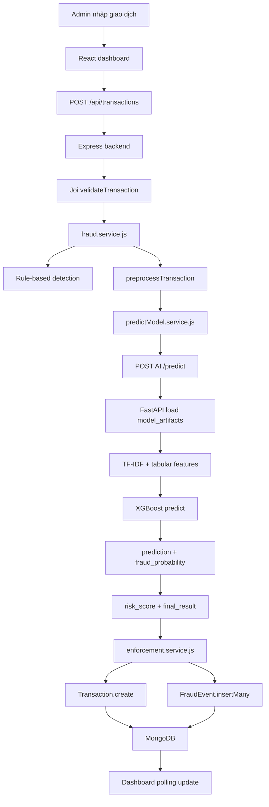

# Sentinel Risk Operations - Fraud Detection AI Dashboard

Sentinel Risk Operations là hệ thống demo phát hiện gian lận giao dịch tài chính theo mô hình microservice phân tán. Ứng dụng mô phỏng dashboard admin của ngân hàng, cho phép kiểm tra giao dịch, đánh giá rủi ro bằng rule-based engine kết hợp AI, lưu lịch sử giao dịch, ghi nhận enforcement log và theo dõi trạng thái vận hành của toàn bộ hệ thống.

## Mục Lục

- [Tổng Quan](#tổng-quan)
- [Chức Năng Chính](#chức-năng-chính)
- [Kiến Trúc Hệ Thống](#kiến-trúc-hệ-thống)
- [Công Nghệ Sử Dụng](#công-nghệ-sử-dụng)
- [Lý Do Chọn Tech Stack](#lý-do-chọn-tech-stack)
- [Cấu Trúc Project](#cấu-trúc-project)
- [Chạy Nhanh Bằng Docker Compose](#chạy-nhanh-bằng-docker-compose)
- [Chạy Local Không Docker](#chạy-local-không-docker)
- [Biến Môi Trường](#biến-môi-trường)
- [Hướng Dẫn Thao Tác Giao Diện](#hướng-dẫn-thao-tác-giao-diện)
- [API Documentation](#api-documentation)
- [Luồng Xử Lý Giao Dịch](#luồng-xử-lý-giao-dịch)
- [Cơ Chế Chống Quá Tải Request](#cơ-chế-chống-quá-tải-request)
- [Model Artifacts](#model-artifacts)
- [Kịch Bản Demo Đề Xuất](#kịch-bản-demo-đề-xuất)
- [Troubleshooting](#troubleshooting)
- [Chuẩn Bị Push GitHub](#chuẩn-bị-push-github)

## Tổng Quan

Hệ thống hỗ trợ nhân sự vận hành ngân hàng kiểm tra và giám sát giao dịch theo thời gian gần thực. Mỗi giao dịch được đánh giá bởi hai lớp:

- Rule-based detection: kiểm tra nhanh theo số tiền, kênh giao dịch và nội dung chuyển khoản.
- AI prediction: gọi FastAPI AI microservice để chạy mô hình XGBoost đã huấn luyện.

Kết quả đánh giá được lưu vào MongoDB và hiển thị trên dashboard với KPI, bảng giao dịch mới nhất, trạng thái service, enforcement log và ops stream. Khi giao dịch có rủi ro cao, backend tạo log nghiệp vụ cho các hành động như chặn giao dịch, khóa tài khoản hoặc khóa thẻ.

## Chức Năng Chính

### Kiểm Tra Giao Dịch

Người dùng nhập các thông tin:

- Mã tài khoản.
- Mã thẻ.
- Tên khách hàng.
- Số tiền.
- Đơn vị tiền tệ.
- Thời gian giao dịch.
- Kênh giao dịch: Mobile, Internet Banking, ATM, POS, Counter, API.
- Merchant.
- Vị trí.
- Nội dung giao dịch.

Hệ thống trả về:

- `rule_based_result`: kết quả từ rule-based engine.
- `ai_result`: kết quả từ AI service.
- `final_result`: kết quả cuối cùng.
- `ai_probability`: xác suất gian lận từ AI.
- `risk_score`: điểm rủi ro tổng hợp.
- `risk_level`: `low`, `medium`, `high`.
- `transaction_status`: `approved`, `review`, `blocked`.
- `account_status`: `active`, `watchlist`, `locked`.
- `card_status`: `active`, `watchlist`, `blocked`.
- `enforcement_actions`: các hành động nghiệp vụ đã kích hoạt.
- `decision_notes`: ghi chú giải thích quyết định.

### Dashboard KPI

Dashboard hiển thị:

- Tổng giao dịch đã xử lý.
- Số giao dịch bị chặn.
- Số tài khoản/thẻ bị khóa.
- Risk score trung bình.
- Tổng giá trị giao dịch rủi ro.

### Trạng Thái Service

Dashboard theo dõi trạng thái:

- Backend API.
- MongoDB database.
- AI inference service.

Nếu một service offline, trạng thái trên giao diện chuyển sang màu đỏ.

### Bảng Giao Dịch Mới Nhất

Bảng giao dịch hiển thị:

- Trạng thái xử lý.
- Mã tài khoản.
- Mã thẻ.
- Số tiền.
- Risk score.
- Nội dung giao dịch.
- Thời gian tạo.

### Enforcement Log

Enforcement log ghi nhận các sự kiện:

- `transaction_blocked`: giao dịch bị chặn.
- `account_locked`: tài khoản bị khóa.
- `card_blocked`: thẻ bị khóa.
- `manual_review`: giao dịch cần soát xét thủ công.

### Ops Stream

Ops stream là log cục bộ trên dashboard, hiển thị:

- Thời điểm dashboard đồng bộ dữ liệu.
- Thời điểm gửi giao dịch tới backend.
- Kết quả quyết định gần nhất.
- Lỗi đồng bộ hoặc lỗi phân tích nếu có.

## Kiến Trúc Hệ Thống

Mỗi service chạy trong một Docker container riêng:

```text
React Frontend  ->  Express Backend  ->  FastAPI AI Service
                         |
                         v
                      MongoDB
```

Chi tiết service:

```text
frontend        -> React dashboard, build bằng Vite, serve bằng nginx
backend         -> Express API, rule engine, enforcement logic
ai-service      -> FastAPI inference service, load model XGBoost
database        -> MongoDB, lưu transactions và fraud events
```

Luồng kết nối trong Docker Compose:

```text
frontend  -> http://localhost:5000
backend   -> mongodb://database:27017/fraud_detection
backend   -> http://ai-service:8000
```

## Công Nghệ Sử Dụng

### Frontend

- ReactJS 18.
- Vite.
- Lucide React icons.
- CSS thuần.
- nginx để serve static assets trong Docker.

### Backend

- Node.js.
- Express.
- Mongoose.
- Joi validation.
- Winston logger.
- Express Rate Limit.

### AI Service

- Python 3.11.
- FastAPI.
- Uvicorn.
- joblib.
- pandas, numpy, scipy.
- scikit-learn.
- XGBoost.

### Database Và DevOps

- MongoDB 7.
- Docker.
- Docker Compose.

## Lý Do Chọn Tech Stack

Project được thiết kế theo hướng microservice để mô phỏng gần hơn một hệ thống vận hành trong ngân hàng: frontend phụ trách dashboard, backend phụ trách nghiệp vụ và điều phối dữ liệu, AI service phụ trách inference model, database phụ trách lưu lịch sử giao dịch và log xử lý. Cách tách lớp này giúp từng phần có thể phát triển, kiểm thử, triển khai và mở rộng độc lập.

| Thành phần | Công nghệ | Lý do chọn |
| --- | --- | --- |
| Frontend dashboard | ReactJS 18 | Phù hợp xây dựng giao diện admin dạng component, dễ tái sử dụng các khối KPI, bảng giao dịch, log và trạng thái service. |
| Build frontend | Vite | Khởi động nhanh, build nhẹ, cấu hình đơn giản, phù hợp project demo và phát triển giao diện liên tục. |
| Icon UI | Lucide React | Bộ icon rõ ràng, nhẹ, dễ đồng bộ phong cách với dashboard nghiệp vụ. |
| Serve frontend | nginx | Serve static assets ổn định trong Docker, gần với cách deploy frontend production. |
| Backend API | Node.js + Express | Dễ xây REST API, xử lý request/response nhanh, phù hợp vai trò API gateway giữa frontend, database và AI service. |
| Database ODM | Mongoose | Chuẩn hóa schema transaction và fraud event, giúp thao tác MongoDB rõ ràng hơn. |
| Validate dữ liệu | Joi | Kiểm tra payload giao dịch trước khi xử lý, giảm lỗi dữ liệu và giúp API có contract rõ ràng. |
| Logging backend | Winston | Ghi log vận hành có cấu trúc, hữu ích khi demo luồng xử lý và debug service. |
| Chống quá tải | Express Rate Limit | Giới hạn request theo nhóm endpoint, tránh frontend polling hoặc thao tác liên tục làm nghẽn backend. |
| AI microservice | Python + FastAPI | Python có hệ sinh thái mạnh cho machine learning; FastAPI nhẹ, nhanh và dễ expose endpoint inference. |
| AI runtime | Uvicorn | ASGI server phổ biến cho FastAPI, phù hợp chạy service inference trong container. |
| Model ML | XGBoost + scikit-learn | Phù hợp bài toán fraud detection trên dữ liệu dạng bảng, dễ load model đã huấn luyện bằng `joblib`. |
| Database | MongoDB 7 | Linh hoạt với transaction log và fraud event có nhiều trường nghiệp vụ, dễ mở rộng schema trong quá trình demo. |
| Container hóa | Docker | Đóng gói từng service với môi trường chạy riêng, tránh lỗi khác biệt môi trường giữa các máy. |
| Điều phối service | Docker Compose | Kết nối frontend, backend, database và AI service thành một hệ thống phân tán hoàn chỉnh chỉ bằng một lệnh. |

Việc tách AI service khỏi backend là điểm quan trọng của kiến trúc này. Backend Node.js tập trung vào nghiệp vụ ngân hàng, rule engine, enforcement log và API cho dashboard; AI service Python tập trung vào model, feature mapping và prediction. Nhờ vậy có thể thay model, scale AI service hoặc debug inference mà không phải sửa toàn bộ backend.

Nếu mục tiêu chỉ là demo nhỏ, hệ thống có thể làm đơn giản hơn bằng cách gộp backend và AI vào một service FastAPI, hoặc bỏ AI service và chỉ dùng rule-based detection trong Express. Tuy nhiên, với mục tiêu báo cáo về microservice AI cho phát hiện gian lận tài chính, kiến trúc hiện tại thể hiện rõ hơn các thành phần của một hệ thống phân tán: dashboard, API nghiệp vụ, database, AI inference và Docker orchestration.

## Cấu Trúc Project

```text
projectNMAI/
|
├── README.md
├── Prompt.md
├── docker-compose.yml
├── .dockerignore
├── .env.example
├── .gitattributes
|
├── frontend/
|   ├── index.html
|   ├── package.json
|   ├── package-lock.json
|   ├── .env.example
|   ├── src/
|   |   ├── main.jsx
|   |   └── styles.css
|   ├── Dockerfile
|   ├── nginx.conf
|   └── .dockerignore
|
├── ai_service/
|   ├── Dockerfile
|   ├── requirements.txt
|   ├── .env.example
|   └── app/
|       └── main.py
|
└── fraud_backend/
    ├── server.js
    ├── package.json
    ├── package-lock.json
    ├── Dockerfile
    ├── .env.example
    ├── .dockerignore
    |
    ├── config/
    |   └── db.js
    ├── controllers/
    |   ├── fraudEvent.controller.js
    |   ├── health.controller.js
    |   └── transaction.controller.js
    ├── middlewares/
    |   ├── error.middleware.js
    |   ├── rateLimit.middleware.js
    |   └── validation.middleware.js
    ├── models/
    |   ├── fraudEvent.model.js
    |   └── transaction.model.js
    ├── routes/
    |   ├── fraudEvent.routes.js
    |   ├── health.routes.js
    |   └── transaction.routes.js
    ├── services/
    |   ├── enforcement.service.js
    |   ├── fraud.service.js
    |   ├── predictModel.service.js
    |   └── preprocess.service.js
    ├── utils/
    |   └── logger.js
    ├── python/
    |   └── predict.py
    └── model_artifacts/
        ├── xgb_fraud_model_combined.joblib
        ├── tfidf_vectorizer.joblib
        ├── robust_scaler.joblib
        ├── tabular_columns.joblib
        └── v_feature_means.joblib
```

## Chạy Nhanh Bằng Docker Compose

Yêu cầu:

- Docker.
- Docker Compose plugin.

Chạy hệ thống:

```bash
cp .env.example .env
docker compose up --build
```

Chạy nền:

```bash
docker compose up -d --build
```

Dừng hệ thống:

```bash
docker compose down
```

Xóa cả volume MongoDB:

```bash
docker compose down -v
```

Các cổng mặc định:

```text
Frontend dashboard: http://localhost:8080
Backend API:         http://localhost:5000
AI service:          http://localhost:8000
MongoDB database:    localhost:27017
```

Kiểm tra trạng thái container:

```bash
docker compose ps
```

Xem logs:

```bash
docker compose logs -f backend
docker compose logs -f ai-service
docker compose logs -f frontend
docker compose logs -f database
```

## Chạy Local Không Docker

### MongoDB

Chạy MongoDB local ở:

```text
mongodb://localhost:27017/fraud_detection
```

### AI Service

```bash
python -m pip install -r ai_service/requirements.txt
export MODEL_ARTIFACT_DIR=fraud_backend/model_artifacts
uvicorn ai_service.app.main:app --host 0.0.0.0 --port 8000
```

Trên Windows PowerShell:

```powershell
python -m pip install -r ai_service\requirements.txt
$env:MODEL_ARTIFACT_DIR="fraud_backend\model_artifacts"
uvicorn ai_service.app.main:app --host 0.0.0.0 --port 8000
```

### Backend

```bash
cd fraud_backend
npm install
npm run dev
```

### Frontend

```bash
cd frontend
npm install
npm run dev
```

Frontend local thường chạy tại:

```text
http://localhost:5173
```

## Biến Môi Trường

Các file `.env.example` được commit làm mẫu. File `.env` thật bị ignore và không nên đưa lên GitHub.

### Root `.env`

```env
COMPOSE_PROJECT_NAME=projectnmai
FRONTEND_PORT=8080
BACKEND_PORT=5000
AI_SERVICE_PORT=8000
MONGODB_PORT=27017
VITE_API_BASE_URL=http://localhost:5000
DASHBOARD_RATE_LIMIT_MAX=2500
DASHBOARD_RATE_LIMIT_WINDOW_MINUTES=15
HEALTH_RATE_LIMIT_MAX=3000
HEALTH_RATE_LIMIT_WINDOW_MINUTES=15
TRANSACTION_RATE_LIMIT_MAX=120
TRANSACTION_RATE_LIMIT_WINDOW_MINUTES=15
```

### Backend

```env
NODE_ENV=development
PORT=5000
MONGO_URI=mongodb://localhost:27017/fraud_detection
AI_SERVICE_URL=http://localhost:8000
AI_SERVICE_TIMEOUT_MS=8000
DASHBOARD_RATE_LIMIT_MAX=2500
DASHBOARD_RATE_LIMIT_WINDOW_MINUTES=15
HEALTH_RATE_LIMIT_MAX=3000
HEALTH_RATE_LIMIT_WINDOW_MINUTES=15
TRANSACTION_RATE_LIMIT_MAX=120
TRANSACTION_RATE_LIMIT_WINDOW_MINUTES=15
```

### Frontend

```env
VITE_API_BASE_URL=http://localhost:5000
```

### AI Service

```env
MODEL_ARTIFACT_DIR=../fraud_backend/model_artifacts
```

## Hướng Dẫn Thao Tác Giao Diện

### 1. Mở Dashboard

Sau khi chạy Docker Compose, mở:

```text
http://localhost:8080
```

### 2. Kiểm Tra Trạng Thái Service

Quan sát góc trên bên phải:

- `Backend`: API server đang hoạt động.
- `MongoDB`: database đang kết nối.
- `AI Service`: service inference đã load model.

Màu xanh nghĩa là online. Màu đỏ nghĩa là offline hoặc health check lỗi.

### 3. Nhập Giao Dịch Thủ Công

Tại form `Kiểm tra giao dịch`, nhập:

- Mã tài khoản.
- Mã thẻ.
- Tên khách hàng.
- Số tiền.
- Thời gian.
- Kênh giao dịch.
- Merchant.
- Vị trí.
- Nội dung.

Bấm `Phân tích` để gửi giao dịch tới backend.

### 4. Dùng Dữ Liệu Mẫu

Dashboard có hai nút:

- `Mẫu an toàn`: điền một giao dịch bình thường.
- `Mẫu rủi ro`: điền một giao dịch có số tiền lớn và nội dung đáng ngờ.

Sau khi chọn mẫu, bấm `Phân tích`.

### 5. Đọc Kết Quả Quyết Định

Khung `Quyết định mới nhất` hiển thị:

- Giao dịch được duyệt hoặc bị chặn.
- Risk score theo phần trăm.
- Rule result.
- AI result.
- Enforcement actions.
- Ghi chú lý do.

### 6. Theo Dõi Bảng Giao Dịch

Bảng `Giao dịch mới nhất` tự cập nhật định kỳ. Người dùng có thể xem:

- Giao dịch nào đã bị chặn.
- Tài khoản/thẻ liên quan.
- Điểm rủi ro.
- Nội dung giao dịch.
- Thời điểm xử lý.

### 7. Theo Dõi Enforcement Log

Khung `Enforcement log` hiển thị các log nghiệp vụ:

- `transaction_blocked`: giao dịch bị chặn.
- `account_locked`: tài khoản bị khóa.
- `card_blocked`: thẻ bị khóa.
- `manual_review`: cần soát xét thủ công.

### 8. Theo Dõi Ops Stream

Khung `Ops stream` hiển thị hoạt động cục bộ của dashboard:

- Đồng bộ dashboard thành công.
- Gửi giao dịch tới backend.
- Kết quả quyết định.
- Lỗi đồng bộ hoặc lỗi phân tích.

## API Documentation

### Backend Health Check

```http
GET /api/health
```

Response mẫu:

```json
{
  "success": true,
  "data": {
    "backend": {
      "online": true,
      "uptime_seconds": 120,
      "environment": "production"
    },
    "database": {
      "online": true,
      "state": 1
    },
    "ai": {
      "online": true,
      "model_loaded": true
    }
  }
}
```

### Tạo Giao Dịch Và Đánh Giá Gian Lận

```http
POST /api/transactions
```

Body mẫu:

```json
{
  "account_id": "ACC-778801",
  "card_id": "CARD-9001",
  "customer_name": "Tran Bao Long",
  "amount": 860000000,
  "currency": "VND",
  "timestamp": "2026-05-25T02:30:00.000Z",
  "content": "tai khoan bi khoa xac minh otp qua link gap",
  "merchant": "Unknown Gateway",
  "channel": "internet_banking",
  "location": "Unknown IP"
}
```

Response rút gọn:

```json
{
  "success": true,
  "data": {
    "rule_based_result": "fraud",
    "ai_result": "fraud",
    "final_result": "fraud",
    "ai_probability": 0.9982,
    "risk_score": 0.9982,
    "risk_level": "high",
    "transaction_status": "blocked",
    "account_status": "locked",
    "card_status": "blocked",
    "enforcement_actions": [
      "transaction_blocked",
      "account_locked",
      "card_blocked"
    ],
    "decision_notes": [
      "Số tiền vượt ngưỡng kiểm soát 500M VND",
      "Nội dung chứa tín hiệu rủi ro: otp",
      "Mô hình AI đánh dấu giao dịch gian lận"
    ]
  }
}
```

### Danh Sách Giao Dịch

```http
GET /api/transactions?page=1&limit=12
```

### Thống Kê Dashboard

```http
GET /api/transactions/stats
```

Các field chính:

```text
total
fraud_count
normal_count
high_risk_count
medium_risk_count
blocked_transactions
locked_accounts_count
blocked_cards_count
enforcement_count
fraud_rate
total_amount
fraud_amount
average_risk_score
last_checked_at
```

### Enforcement Log

```http
GET /api/fraud-events?page=1&limit=12
```

Query optional:

```text
event_type=transaction_blocked|card_blocked|account_locked|manual_review
severity=low|medium|high|critical
```

### AI Service Health

```http
GET /health
```

### AI Prediction

```http
POST /predict
```

Body mà backend gửi sang AI service:

```json
{
  "amount": 860000000,
  "time": 1779651000,
  "timestamp": "2026-05-25T02:30:00.000Z",
  "Transaction_Content": "tai khoan bi khoa xac minh otp qua link gap Unknown Gateway internet_banking Unknown IP"
}
```

Response:

```json
{
  "success": true,
  "data": {
    "prediction": "fraud",
    "confidence": 0.9982,
    "fraud_probability": 0.9982,
    "model": "xgb_fraud_model_combined"
  }
}
```

## Luồng Xử Lý Giao Dịch



## Data Model Tóm Tắt

### Transaction

Các field chính:

```text
account_id
card_id
customer_name
amount
currency
timestamp
content
merchant
channel
location
rule_based_result
ai_result
final_result
ai_probability
ai_confidence
risk_score
risk_level
ai_service_status
decision_notes
transaction_status
account_status
card_status
enforcement_actions
createdAt
updatedAt
```

### FraudEvent

Các field chính:

```text
transaction
event_type
severity
account_id
card_id
customer_name
amount
currency
risk_score
reason
metadata
createdAt
updatedAt
```

## Cơ Chế Chống Quá Tải Request

Dashboard có polling định kỳ. Để tránh bị nghẽn hoặc tự chạm rate limit:

- Frontend refresh mỗi 10 giây.
- Frontend không gửi batch request mới nếu batch cũ chưa hoàn tất.
- Backend tách rate limit đọc và ghi:
  - Dashboard read API có hạn mức cao.
  - Health check có hạn mức riêng.
  - API tạo giao dịch có hạn mức riêng để tránh spam phân tích.

Biến cấu hình:

```env
DASHBOARD_RATE_LIMIT_MAX=2500
DASHBOARD_RATE_LIMIT_WINDOW_MINUTES=15
HEALTH_RATE_LIMIT_MAX=3000
HEALTH_RATE_LIMIT_WINDOW_MINUTES=15
TRANSACTION_RATE_LIMIT_MAX=120
TRANSACTION_RATE_LIMIT_WINDOW_MINUTES=15
```

## Model Artifacts

Thư mục `fraud_backend/model_artifacts/` chứa các artifact dùng cho inference:

- `xgb_fraud_model_combined.joblib`: mô hình XGBoost.
- `tfidf_vectorizer.joblib`: vectorizer cho nội dung giao dịch.
- `robust_scaler.joblib`: scaler cho `Amount` và `Time`.
- `tabular_columns.joblib`: danh sách và thứ tự cột tabular khi train.
- `v_feature_means.joblib`: giá trị mean cho các cột `V1` đến `V28`.

AI service copy các artifact này vào image tại:

```text
/app/model_artifacts
```

Lưu ý khi train lại model:

```python
joblib.dump(xgb_model_combined, "xgb_fraud_model_combined.joblib")
joblib.dump(tfidf, "tfidf_vectorizer.joblib")
joblib.dump(scaler, "robust_scaler.joblib")
joblib.dump(tabular_columns, "tabular_columns.joblib")
joblib.dump(v_feature_means, "v_feature_means.joblib")
```

Thứ tự feature khi inference phải giữ đúng:

```text
X = [TF-IDF text features, tabular features]
```

## Kịch Bản Demo Đề Xuất

1. Chạy `docker compose up --build`.
2. Mở dashboard tại `http://localhost:8080`.
3. Kiểm tra ba service `Backend`, `MongoDB`, `AI Service` đều online.
4. Chọn `Mẫu an toàn`, bấm `Phân tích`.
5. Quan sát giao dịch được duyệt và risk score thấp.
6. Chọn `Mẫu rủi ro`, bấm `Phân tích`.
7. Quan sát giao dịch bị chặn, tài khoản bị khóa, thẻ bị khóa.
8. Kiểm tra bảng `Giao dịch mới nhất`.
9. Kiểm tra `Enforcement log` để thấy các event nghiệp vụ.
10. Mở `Ops stream` để xem log thao tác trên dashboard.

## Troubleshooting

### AI service báo lỗi thiếu pandas

Đảm bảo `ai_service/requirements.txt` có:

```text
pandas==2.2.3
```

Sau đó rebuild:

```bash
docker compose build ai-service
docker compose up -d --force-recreate ai-service backend frontend
```

### Dashboard báo quá tải request

Đảm bảo đang dùng bản mới có:

- `frontend/src/main.jsx` refresh mỗi 10 giây.
- `fraud_backend/middlewares/rateLimit.middleware.js`.
- Các biến `DASHBOARD_RATE_LIMIT_MAX`, `HEALTH_RATE_LIMIT_MAX`, `TRANSACTION_RATE_LIMIT_MAX`.

Rebuild backend và frontend:

```bash
docker compose up -d --build backend frontend
```

### Frontend không gọi được backend

Kiểm tra biến build-time:

```env
VITE_API_BASE_URL=http://localhost:5000
```

Rebuild frontend:

```bash
docker compose build frontend
docker compose up -d frontend
```

### Backend không kết nối MongoDB trong Docker

Trong Docker Compose phải dùng:

```env
MONGO_URI=mongodb://database:27017/fraud_detection
```

Không dùng `localhost` từ container backend để trỏ tới MongoDB container.

### Xem logs nhanh

```bash
docker compose logs --tail=120 backend
docker compose logs --tail=120 ai-service
docker compose logs --tail=120 frontend
docker compose logs --tail=120 database
```

## Chuẩn Bị Push GitHub

Repo đã được chuẩn bị để không commit artifact local:

- `.env` bị ignore, chỉ commit `.env.example`.
- `node_modules/` bị ignore.
- `dist/` bị ignore.
- `logs/` và `*.log` bị ignore.
- `__pycache__/` bị ignore.
- `.joblib` được đánh dấu binary trong `.gitattributes`.

Kiểm tra trước khi commit:

```bash
git status
git diff --check
docker compose config
```

Commit gợi ý:

```bash
git add -A
git commit -m "Document distributed fraud detection dashboard"
```

Push GitHub:

```bash
git remote add origin <your-github-repo-url>
git branch -M main
git push -u origin main
```
